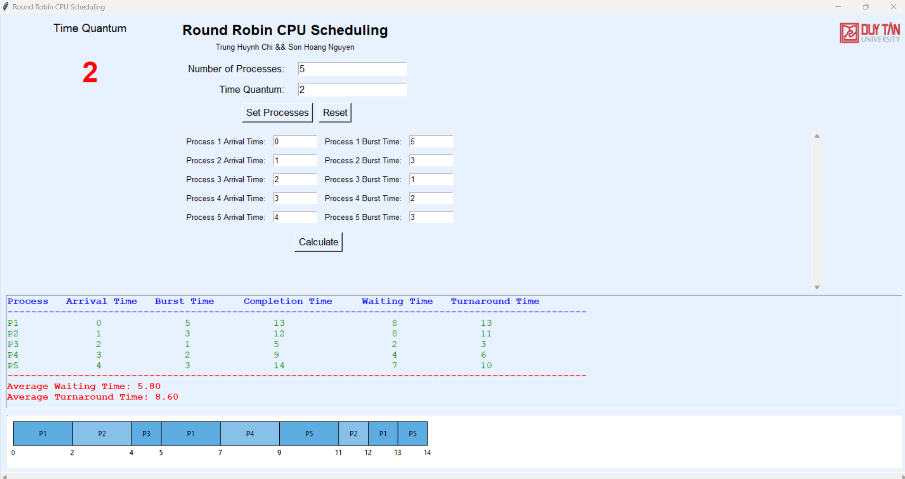

# Round Robin Scheduling Algorithm 🚀💻

The following categories highlight the core features and technologies used in this project:

  
  
  
  
  
  

---

## Project Overview 🌟

This project implements the **Round Robin Scheduling Algorithm** using Python. It provides:

- 🎯 **Interactive user inputs** for process details and time quantum.
- 📊 **Gantt chart visualization** for execution timelines.
- 📈 **Detailed metrics** like waiting time, turnaround time, and completion time.
- 🔄 **Reset functionality** for multiple input scenarios.

The project is designed to simulate CPU scheduling in operating systems and serve as an educational tool for understanding process scheduling concepts.

## Features 🛠️

- **Dynamic Input**: Easily configure the number of processes and their attributes (arrival time, burst time).
- **Gantt Chart Visualization**: View execution order with a clear graphical representation.
- **Performance Metrics**: Automatic computation and display of key scheduling statistics.
- **User-Friendly Interface**: Built using Python's Tkinter library for ease of use.

## Usage 🖥️

1. Clone the repository:
   ```bash
   git clone https://github.com/huynhtrungcip/round-robin-scheduling.git
   ```
2. Navigate to the project directory:
   ```bash
   cd round-robin-scheduling
   ```
3. Check and install Pillow library
   ```bash
   pip install Pillow
   ```
4. Run the script:
   ```bash
   python round_robin.py
   ```
5. Enter the process details and time quantum in the interface, then click "Calculate" to see results.

## Screenshots 📸



---

## License 📝

This project is licensed under the Proprietary License. See the [LICENSE](LICENSE) file for details.

## Author ✍️

[Trung Huynh](https://www.linkedin.com/in/trung-huynh-chi-pc01/)  
Cybersecurity enthusiast with hands-on experience in Python and algorithm design.

---

**Contributions**: Contributions are welcome! Feel free to open issues or submit pull requests to improve this project.
